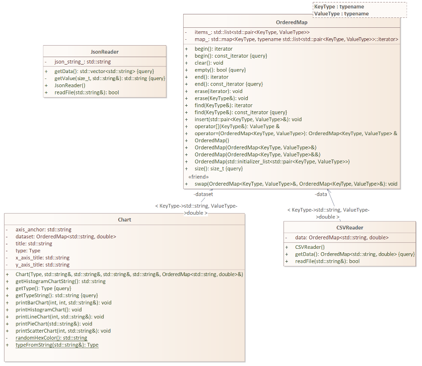

# SVG-Graph-Generator

Simple Chart Builder notions

# Fundamental objective

- Implementation of bar, line, scatter, pie chart
- Generate charts based on data read from a CSV file
- Read chart configuration specified in a JSON file
- Being clean and comply with general conventions
- Histogram in text console
- Output as SVG

# Libraries

```cpp
#include <iostream>
#include <iomanip>
#include <string>
#include <fstream>
#include <sstream>
#include <cmath>
#include <climits>
#include <vector>
#include <filesystem>
#include <map>
#include <list>
#include <cstddef>
```

# Test case
```cpp
#include "OrderedMap.hpp"
#include "JsonReader.hpp"
#include "CSVReader.hpp"
#include "Chart.hpp"

#include <list>
#include <string>
#include <stdexcept>
#include <algorithm>

int main(int argc, char *argv[])
{
    const std::string settings_filename = "test_settings.json";
    const std::string data_filename = "test_data.csv";

    JsonReader jsonReader;
    CSVReader csvReader;

    jsonReader.readFile(settings_filename);
    csvReader.readFile(data_filename);

    const std::vector<std::string> &settings_data = jsonReader.getData();
    const OrderedMap<std::string, double> &csv_data = csvReader.getData();

    Chart chart1 = Chart(
        Chart::Type::BAR, settings_data[1], settings_data[2], settings_data[3], settings_data[4], csv_data);

    Chart chart2 = Chart(
        Chart::Type::LINE, settings_data[1], settings_data[2], settings_data[3], settings_data[4], csv_data);

    Chart chart3 = Chart(
        Chart::Type::PIE, settings_data[1], settings_data[2], settings_data[3], settings_data[4], csv_data);

    Chart chart4 = Chart(
        Chart::Type::SCATTER, settings_data[1], settings_data[2], settings_data[3], settings_data[4], csv_data);

    chart1.printBarChart(50, 10, "test1.svg");
    chart2.printLineChart(10, "test2.svg");
    chart3.printPieChart("test3.svg");
    chart4.printScatterChart(10, "test4.svg");

    return 0;
}
```

# Expected file structure
- include/Chart.hpp
- include/CSVReader.hpp
- include/JsonReader.hpp
- include/OrderedMap.hpp
- src/Chart.cpp
- src/CSVReader.cpp
- src/JsonReader.cpp
- src/main.cpp
- src/OrderedMap.cpp
- settings.json
- data.csv
- CMakeLists.txt

# Class Diagram

